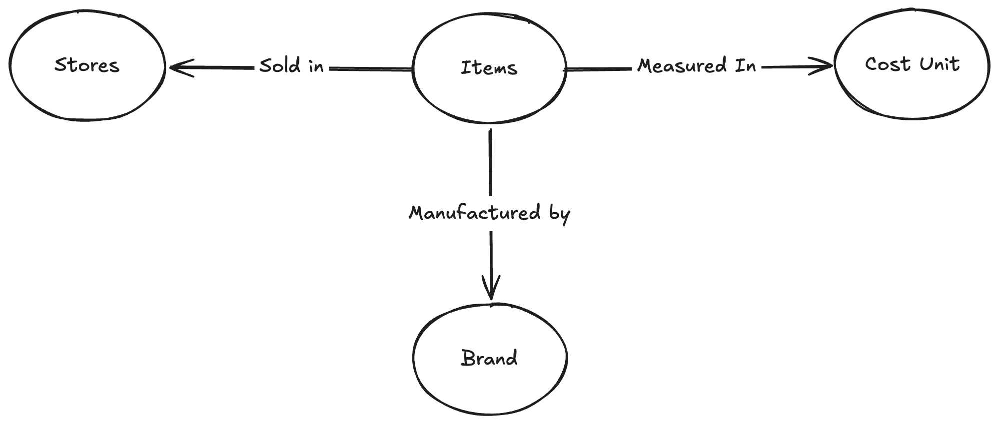

# Pantry Domains

While working on Pantry, we are _some_ patterns of Domain Driven Design[^1]. I will try my best to keep this document as much up-to-date as possible.

## Pantry
An app that allows you to track prices of day-to-day items in your Pantry (technically fridge items too?) in a common unit. This information will allow you to make a smart choice and buy the item from the shop with the best price. 

This is my real world problem, that this program will try to solve.

## Stores
A store (physical or online) that is selling the item you would like to track, and compare the prices of the item from this store with others in the area.

## Item
A literal piece of an item for which, you would like to track prices across different stores.

## Cost Unit
A common unit for the item. This will allow users to easily compare which store sells the item for the cheapest, as the prices are converted into a common unit.

Ex. Stores often have different prices for the same item, alongside with different sizes (ex. 1kg vs 1lb). The app will convert all prices into a common unit/measurement (ex. X per 100g), which makes it very easy for someone to find the best store to shop at.

## Brand
A company that is producing a specifc item. Note that one store can contain items from multiple brands, each with their own size and prices.

[^1]: Domain Driven Design is a pattern that allows you to develop an application that is closer to the definition and needs of the actual practice domain of the final output, rather than treating the application purely as an piece of art for Computer Engineering. You can learn more about it [here](https://en.wikipedia.org/wiki/Domain-driven_design).
